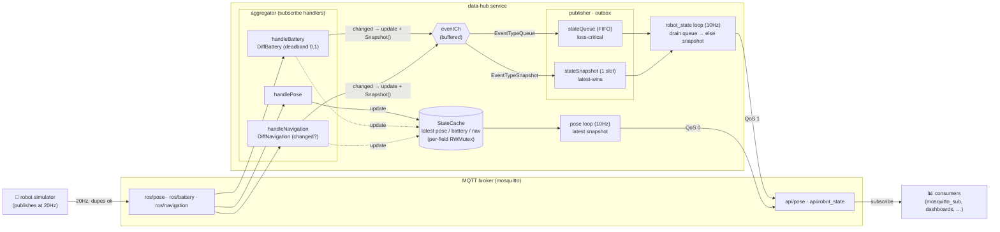

# data-hub

### Overview

This is an example service that aggregates various types of data into a single object and publishes them using an event-driven architecture.

The data handled by this service is broadly categorized into three types:

**1. High-Frequency Data** (e.g., Robot Pose)

* Processing every single state change in a high-frequency stream is highly inefficient.
* Instead of triggering an event for every change, this data relies on an internal **time window** to periodically publish the latest snapshot.

**2. Noisy / Fluctuating Data** (e.g., Battery Status)

* Sensor readings like battery levels are prone to noise and micro-fluctuations (jitter).
* To prevent unnecessary updates from these tiny jitters, a publish event is triggered *only* when the change in value exceeds a predefined **delta threshold** (deadband).

**3. Mission-Critical / Loss-Sensitive Data** (e.g., Navigation Messages)

* While dropping some telemetry data might be acceptable, losing state changes in critical data can severely disrupt higher-level logic.
* The system is specifically designed to guarantee that these crucial navigation-related messages are processed and published without any data loss.

### Objective & Output

The primary goal is to process each message type via an event-driven approach—applying the specific optimizations mentioned above (like time windows for high-frequency data)—while also publishing a single, consolidated payload containing the aggregated state.

As a result, this example program publishes the following **four distinct topics**:

* `/pose`
* `/battery`
* `/navigation`
* `/robot_state` *(The aggregated object combining all of the above)*

### Architecture



**Flow in words**

1. The **simulator** floods `ros/*` at 20Hz (duplicates expected).
2. The **aggregator** debounces per type: pose is stored as-is; battery only fires when it moves past the delta threshold; navigation only fires on an actual state change.
3. A firing handler writes the latest value into **`StateCache`** and pushes a full **snapshot** onto `eventCh` — tagged `EventTypeQueue` (navigation, loss-critical) or `EventTypeSnapshot` (battery, loss-tolerant).
4. The **outbox** routes queue events into a lossless FIFO and snapshot events into a single latest-wins slot.
5. Two 10Hz loops publish: `api/robot_state` drains the queue first (falls back to the snapshot slot), and `api/pose` emits the latest cached pose.

### Data Structure

```go
// Pose represents a geometeric position of robot.
type Pose struct {
    x float64
    y float64
}

// Battery represents a rest of battery level of robot.
type Battery struct {
    level float64
}

// NavigationStatus represents a current navigation situation.
type NavigationStatus int

const (
    NavStUnknown NavigationStatus = iota
    NavStNavigating
    NavStStuck
    NavStArrived
)

// Navigation represents the waypoints within a robot's path and its navigation situation.
type Navigation struct {
    cNode  string
    status NavigationStatus
}

// RobotState represents a snapshot of a robot's overall data.
type RobotState struct {
    pose       Pose
    battery    Battery
    navigation Navigation
}
```


Memo

생각하는 대략적인 구조.
Receiver단 - zenoh로 부터 읽어서 chan으로 쏜다.

Aggregator단 - 
캐시 struct 에는 sync.Mutex가 좋을까 sync.Map이 좋을까?
왜냐면 Pose가 상당수 Mutex를 다 차지할 것 같아서.


Publisher단 - 토픽별로 publish하는 구조.
/pose > 10Hz > current value
/battery > publish notify > current value
/navigation > if queue is not empty > queued value
/robot_state > battery와 navigation이 발행할 당시의 snapshot value를 queue? > seq와
우선순위 (nav > battery)에 따라서 heap에 넣었다가 발행 ?
e.g., PublishEvent{seq int or timestamp, priority int, data RobotState} > push heap > pop heap >
validate last published seq > publish > update last published seq

### Design Comparison: heap vs queue+slot

|                                    | heap                | queue+slot              |
| ---------------------------------- | ------------------- | ----------------------- |
| priority 3단계 이상                | ✓ 유리              | ✗                       |
| 2클래스 고정 + 토픽 증가           | 동작함              | ✓ 더 단순               |
| 코드 복잡도                        | 정렬 + drop 로직    | O(1), 의도 명확         |

### Running

The whole stack — MQTT broker, the data-hub service, and a robot simulator — runs
with Docker Compose:

```bash
docker compose up --build     # build images and start all three services
docker compose down           # stop and remove everything
```

Three services come up:

| Service     | Role                                                                 |
| ----------- | ------------------------------------------------------------------- |
| `mosquitto` | MQTT broker (port `1883`)                                           |
| `simulator` | Publishes raw feeds to `ros/pose`, `ros/battery`, `ros/navigation` at 20Hz |
| `data-hub`  | Subscribes to `ros/*`, aggregates, and republishes to `api/*`       |

**Topics**

| Direction        | Topic               | QoS | Notes                                    |
| ---------------- | ------------------- | --- | ---------------------------------------- |
| simulator → hub  | `ros/pose`          | 0   | 20Hz, duplicates expected                |
| simulator → hub  | `ros/battery`       | 0   | 20Hz, debounced by delta threshold       |
| simulator → hub  | `ros/navigation`    | 1   | loss-critical                            |
| hub → consumers  | `api/pose`          | 0   | 10Hz time-window snapshot                |
| hub → consumers  | `api/robot_state`   | 1   | aggregated state (battery delta + nav events) |

#### Watching the messages yourself

The broker container ships with `mosquitto_sub`, so you can subscribe from inside it:

```bash
# aggregated output (both api/ topics), showing the topic name with -v
docker compose exec mosquitto mosquitto_sub -t 'api/#' -v

# just the consolidated robot state
docker compose exec mosquitto mosquitto_sub -t 'api/robot_state' -v

# raw feeds coming from the simulator
docker compose exec mosquitto mosquitto_sub -t 'ros/#' -v
```

Follow the simulator's scenario (drive → stuck → drive → arrive) in its logs:

```bash
docker compose logs -f simulator
```

In `api/robot_state` look at `Header.EventType`: `1` = battery snapshot (loss-tolerant),
`2` = navigation event (loss-critical, delivered in order). If you have `jq`, pretty-print with:

```bash
docker compose exec mosquitto mosquitto_sub -t 'api/robot_state' | jq .
```

If you prefer to run without Docker, start a local broker (`mosquitto -p 1883`) and then
`go run .` (the service) and `go run ./cmd/simulator` (the robot) in separate terminals.

